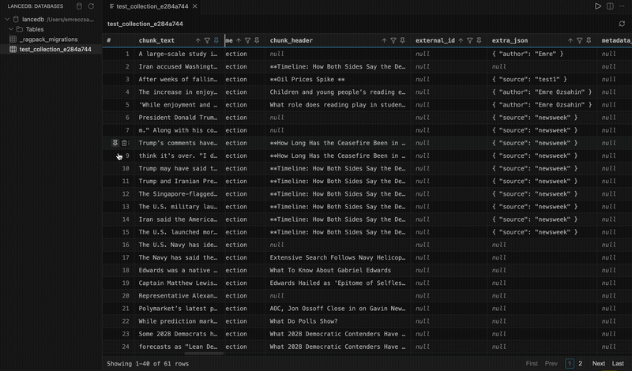

# LanceDB Explorer

Browse LanceDB databases and tables directly inside VS Code.



## Features

- Open any local LanceDB database from the sidebar and browse its tables in a tree view.
- View table data in a paginated, resizable grid (powered by [Tabulator](https://tabulator.info/)).
- Column type hints, row numbers, hover tooltips for full cell content, and one-click copy to clipboard.
- **Edit cell values** — click the pencil icon to edit in a modal, including JSON editing for list/vector columns. Values are validated against the column's type before saving.
- **Clear a cell to null** with one click, on any nullable column.
- **Delete a row** via the row-number column, with a Cancel/Delete confirmation prompt since it can't be undone.
- **Pin rows** to keep them visible above the current page regardless of sorting, filtering, or pagination.
- **Sort by column** — pushes a real `ORDER BY` to LanceDB (not just a local re-sort of the current page), so it's consistent across pagination.
- **Filter by column** — case-insensitive text/number/boolean matching, pushed to LanceDB as a `WHERE` clause; matches update the row count and pagination too.
- **Pin columns** to keep them visible while scrolling horizontally; multiple pinned columns stack side by side at the left edge.
- Matches your VS Code theme automatically (light, dark, and high-contrast).

## Usage

1. Open the Command Palette and run **LanceDB: Open Database...**, then select a LanceDB database directory.
2. Expand the database in the **LanceDB** view (Activity Bar) → **Tables** to see the tables it contains.
3. Click a table to open it in a data grid. Use the toolbar at the bottom to page through rows.
4. Hover a cell for copy/edit/clear actions, or hover a row number for pin/delete. Hover a column header for sort, filter, and pin controls.

## Development

```sh
npm install
npm run watch   # rebuild the extension and webview bundles on change
```

Press `F5` in VS Code to launch an Extension Development Host with the extension loaded.

Other scripts:

```sh
npm run typecheck   # type-check the extension host and webview code
npm run build        # production build
npm run package       # package a .vsix with vsce
```

## Requirements

- Node.js >= 18 (required by the LanceDB native bindings)

## License

Apache-2.0 — see [LICENSE](LICENSE).
